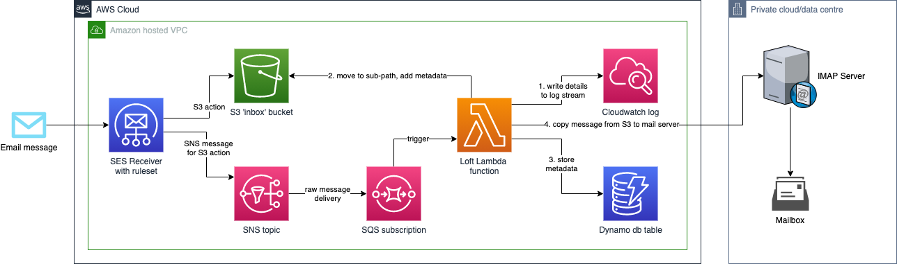

# Loft 🕊
Receive email via Amazon Simple Email Service (SES) and synchronise it to a designated IMAP mailbox. Adequate logging, persistence in S3 and Dynamo DB is part of the handler's process.

## Purpose
For anyone who wants to keep their email address anonymous, Loft is a catch-all email receiver based on AWS. Loft moves email sent to any '[alias]@[mydomain].com'  to an IMAP mailbox such as Gmail. Unlike email providers who allow for the addition of a '+' in email addresses to create aliases (e.g. johndoe+contoso@example.com), Loft works with any registered alias, for any domain name you register. Thereby solving the problem that email addresses often contain (parts of) a real name. What's more is that with a few dozen emails per day, the solution is practically $0 on your AWS bill too!

### Name
This project is named after the construction that houses homing pigeons: a Loft. Each pigeonhole is essentially a separate mailbox.

# Architecture

**The following AWS services are used:** CloudFormation, SES, SNS, SQS, S3, CloudWatch, Dynamo DB, Lambda and IAM.

## Prerequisites
- Domain name with control over MX records in DNS
- Configured Amazon Simple Email Service to receive email on the domain ([guide](https://docs.aws.amazon.com/ses/latest/DeveloperGuide/receiving-email-setting-up.html))
- S3 bucket for the build artifacts (Loft will be deployed from this bucket)
- Mailbox that supports IMAP for synchronising email (e.g. [Gmail](https://support.google.com/mail/answer/7126229?hl=en-GB))
  - IMAP credentials for the destination mail server (e.g. [Gmail app password](https://support.google.com/mail/answer/185833?hl=en-GB) is recommended to avoid using your main password)
- AWS IAM access credentials with appropriate permissions to deploy using CloudFormation.  
  An account with programmatic access and AWS built-in _full-access_ policies for abovementioned services is recommended.

# Setup
The simplest means of installation is to **fork** this repository, then follow these steps:
Configure Github secrets for each of the [Cloudformation parameters](./template.yaml) per the table below, and for the deployment's [AWS Credentials](https://github.com/aws-actions/configure-aws-credentials#usage).

| Lambda env var/SAM parameter | GitHub actions secret | Required | Comment |
| ---------------------------- | --------------------- | -------- | ------- |
| n/a | `ARTIFACT_BUCKET_NAME` | yes | e.g. `aws-sam-artifacts` |
| `LoftDomain` | `LOFT_DOMAIN` | yes | e.g. `example.com` |
| n/a | `AWS_ACCESS_KEY_ID` | yes | Deployment user |
| n/a | `AWS_SECRET_ACCESS_KEY` | yes | Deployment user |
| `IMAPServer` | `IMAP_SERVER` | yes | requires SSL/TLS |
| `IMAPUsername` | `IMAP_USERNAME` | yes | |
| `IMAPPassword` | `IMAP_PASSWORD` | yes | |
| `IMAPDestinationFolder` | n/a | no | default: `INBOX` |
| `IMAPMarkAsRead` | n/a | no | default: `false` |
| `IMAPDebugLogging` | n/a | no | default: `false` |

**Note:** the default AWS region is Ireland (`eu-west-1`). You can change this in [`samconfig.toml`](./samconfig.toml).

## Deployment
This script uses AWS CloudFormation to deploy the Lambda function. If the AWS CloudFormation stack that contains the resources already exists, the script updates it with any changes to the template or function code.

Run the [GitHub action](./.github/workflows/main.yml) to trigger the deployment into your AWS account.

_Note: this app is not deployed to the Serverless Application Repository because SES is not a supported resource._

## Activation
Ensure you set the newly created Amazon SES rule set as **active** under _Email receiving_ > _Rule Sets_.

## Cleanup
**Warning! This permanently destroys all email in the S3 bucket and Dynamo DB.**  
To delete the application, run the cleanup script: `loft$ scripts/6-remove.sh`.

# Contributing
We'd love contributions that help to build a web UI on top of Dynamo DB, providing metrics on incoming mail and used aliases for the domain.

The project source includes function code and supporting resources:
- `src/` - C# .NET Core Lambda function with the solution file in the repository root under `Loft.sln`.
- `doc/` - Architecture diagram from [Draw.io](https://www.draw.io).
- `scripts/` - Shell scripts that use the AWS SAM CLI to deploy and manage the application.

## Prerequisites
To develop on any platform, you'll need the following toolchain:
- [.NET Core 3.1 SDK](https://dotnet.microsoft.com/download/dotnet-core/3.1) (or higher)
- [AWS extensions for .NET CLI](https://github.com/aws/aws-extensions-for-dotnet-cli)
- [AWS CLI v1](https://docs.aws.amazon.com/cli/latest/userguide/cli-chap-install.html).
- [AWS Serverless Application Model (SAM) CLI](https://docs.aws.amazon.com/serverless-application-model/latest/developerguide/serverless-sam-cli-install.html)
